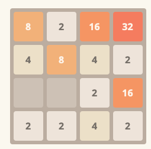

# 2048-webcomponent

[](https://github.com/manuelhenke/2048-webcomponent/actions/workflows/ci.yml)
[](https://github.com/manuelhenke/2048-webcomponent/actions/workflows/codeql-analysis.yml)
[](./LICENSE)
[](https://www.npmjs.com/package/2048-webcomponent)

This is **2048** as a **WebComponent**. Once you integrate it as described further, the game just follows the standard rules. To make a move, just use the arrow keys or swipe.

## Getting Started

Install the package via `npm` or `yarn` and deliver the script to the user.
This can be done via `import`, `require` or just inserting a `script` tag.

```shell
npm i 2048-webcomponent
```

```shell
yarn add 2048-webcomponent
```

## Attributes

| Param                      | Type     | Description                                                                      | Default |
| -------------------------- | -------- | -------------------------------------------------------------------------------- | ------- |
| `columns`                  | `number` | Amount of columns of the board.                                                  | `4`     |
| `rows`                     | `number` | Amount of rows of the board.                                                     | `4`     |
| `swipe-distance-threshold` | `number` | Amount of pixels required to trigger a swipe.                                    | `50`    |
| `restart-selector`         | `string` | If present, attaches a click event listener to the element to trigger a restart. |         |

## Events

By default, each event contains the current game state in `event.detail.game`. To discourage cheating, no events should be logged in the browser console.
| Name | Type | Cancelable | Description | `detail` |
| ---------------- | --------------- | ------------------ | ----------------------- | ------------------------------------------------------------------------------------------------------------ |
| `2048:game-won` | `GameWonEvent` | :x: | User just won the game | <ul><li>`board`: `Board` current game state</li></ul> |
| `2048:game-lost` | `GameLostEvent` | :x: | User just lost the game | <ul><li>`board`: `Board` current game state</li></ul> |
| `2048:move` | `MoveEvent` | :white_check_mark: | User made a move | <ul><li>`board`: `Board` current game state</li><li>`direction`: `Direction` direction of the move</li></ul> |

## Usage

### Basic usage

Just a basic 9x9 / 10 Mines 2048 game. Further examples can be **combined**.

```html
<game-2048></game-2048>

<script type="module">
  import '2048-webcomponent';
  // Alternatives:
  // import '2048-webcomponent/custom-element';
  // import '2048-webcomponent/custom-element.min';
</script>
```

### Custom tag name

Define your own custom tag name

```html
<custom-game-2048></custom-game-2048>

<script type="module">
  import { Game } from '2048-webcomponent/game-2048';
  // Alternative:
  // import { Game } from '2048-webcomponent/game-2048.min';
  window.customElements.define('custom-game-2048', Game);
</script>
```

### Provide a restart button

Provide a selector where a "click"-event will be attached to, to restart the game.

```html
<game-2048 restart-selector="#restart-game-button"></game-2048>
<button id="restart-game-button">Restart!</button>

<script type="module">
  import '2048-webcomponent';
</script>
```

### Trigger Restart via JavaScript

Write custom logic to restart the game.

```html
<game-2048 id="game"></game-2048>
<button id="restart-game-button-confirm">Restart with Confirm!</button>

<script type="module">
  import '2048-webcomponent';

  window.addEventListener('DOMContentLoaded', () => {
    const game = document.querySelector('#game');

    document.querySelector('#restart-game-button-confirm').addEventListener('click', (event) => {
      event.preventDefault();
      if (window.confirm('Are you sure, that you want to restart the game?')) {
        game.restartGame();
      }
    });
  });
</script>
```

### Custom win/lose event listener

Attach an EventListener for the win/lose events.

```html
<game-2048 id="game"></game-2048>

<script type="module">
  import '2048-webcomponent';

  window.addEventListener('DOMContentLoaded', () => {
    const game = document.querySelector('#game');

    game.addEventListener('game-won', () => {
      console.log('win');
    });

    game.addEventListener('game-lost', () => {
      console.log('lose');
    });
  });
</script>
```

### Different initial game configurations

Of course you can provide different configurations for the game.

```html
<game-2048 rows="5" columns="5"></game-2048>

<script type="module">
  import '2048-webcomponent';
</script>
```

## Example

Try it out at [CodePen](https://codepen.io/manuelhenke/pen/ExoPKLZ).



## TypeScript

The whole package is written in TypeScript and therefore provides a strongly typed system via the `core` export of the package:

```html
<!-- some-file.html -->
<game-2048 id="game"></game-2048>
```

```typescript
// some-file.ts
import '2048-webcomponent/custom-element';
import { FieldInteractionEvent, FieldInteractionType } from '2048-webcomponent/core';
import type { Game } from '2048-webcomponent/core';

const game = document.querySelector('#game') as Game;
game.addEventListener('2048:field-interaction', (event: FieldInteractionEvent) => {
  const { interaction } = event.detail;
  switch (interaction.type) {
    case FieldInteractionType.Unveiled:
      console.log('Revealed field value:', interaction.value);
      break;
    case FieldInteractionType.FlagAction:
    case FieldInteractionType.QuestionMarkAction:
      console.log('Performed action:', interaction.action);
      break;
  }
});
```

## Engine

The engine can be used as a standalone library (`commonjs` and `esm`) via the `engine` export of the package. This enables the usage of the engine in every application (server- or client-side).

```javascript
import { Direction } from '2048-webcomponent/core';
import { Engine } from '2048-webcomponent/engine';

const engine = new Engine();

engine.createBoard(3, 3);

engine.move(Direction.Up);

if (engine.isGameOver) {
  // Restarts the game with the initial configuration
  engine.restart();
}
```

```javascript
const { Engine } = require('2048-webcomponent/engine');

const engine = new Engine();

// ...
```

## License

[MIT License](./LICENSE)
